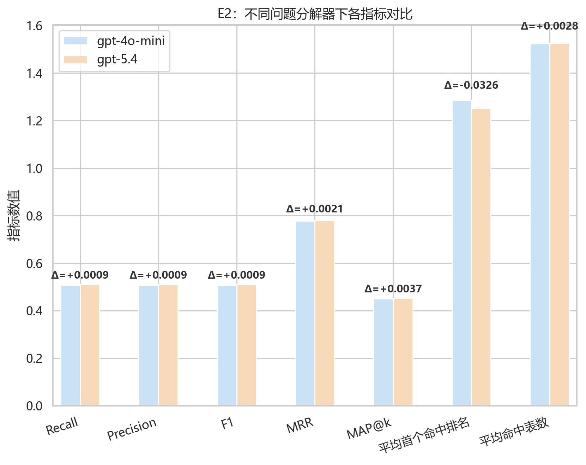
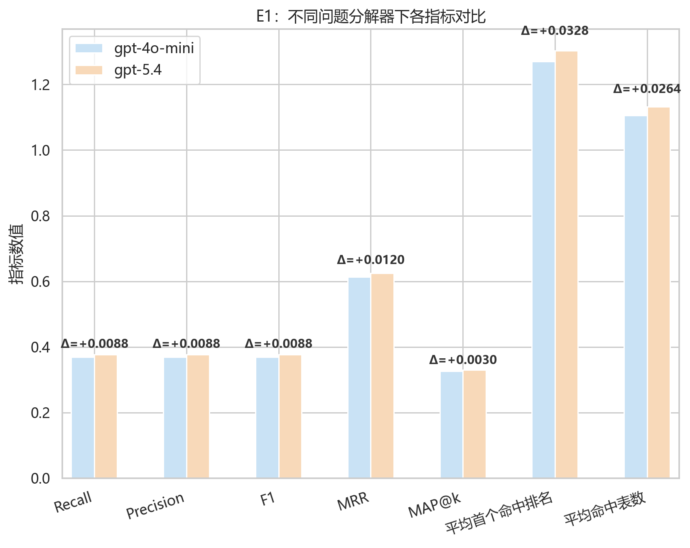
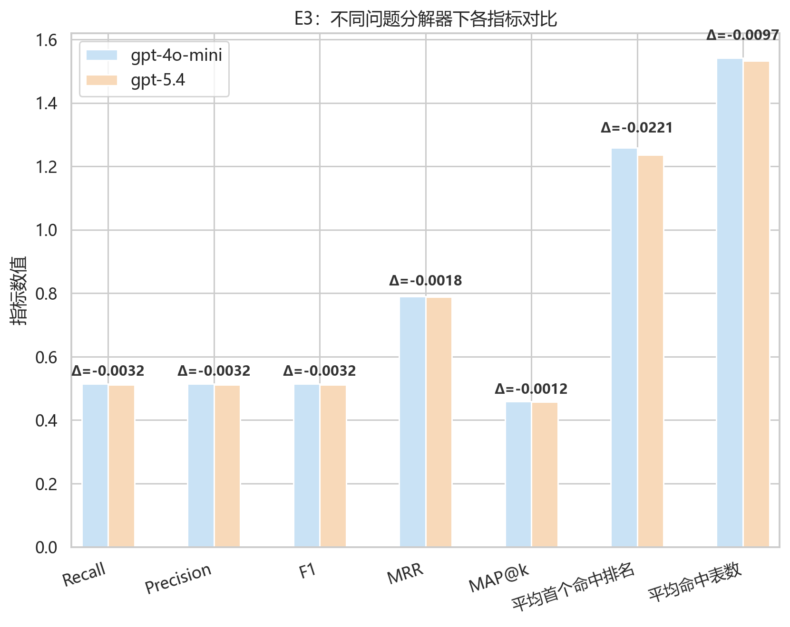
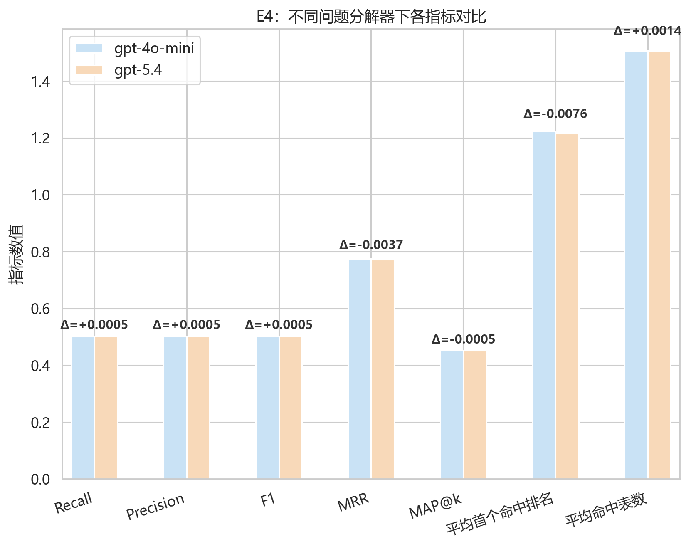
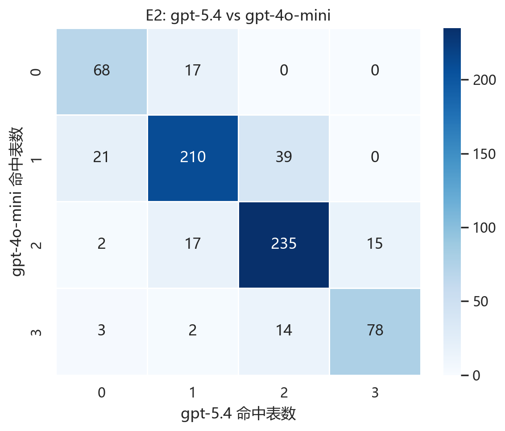
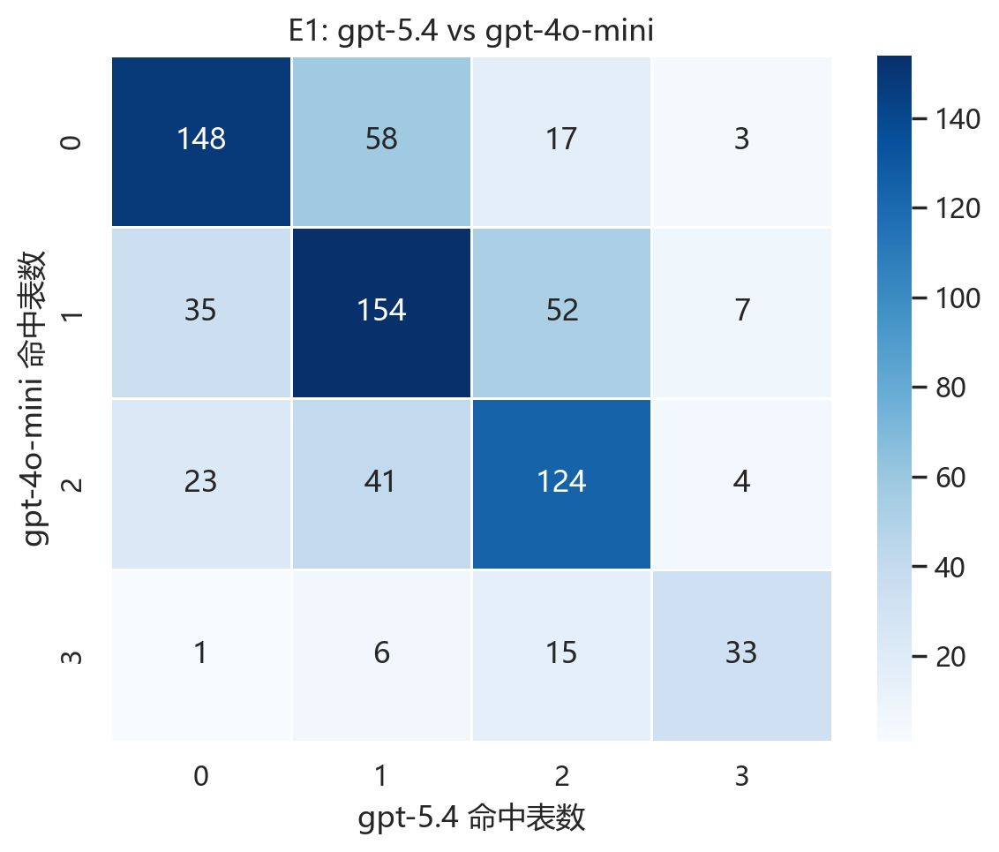
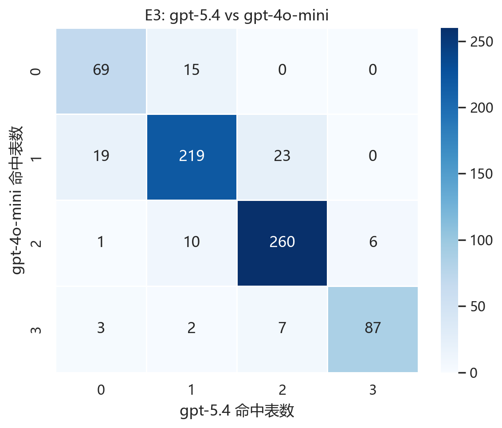
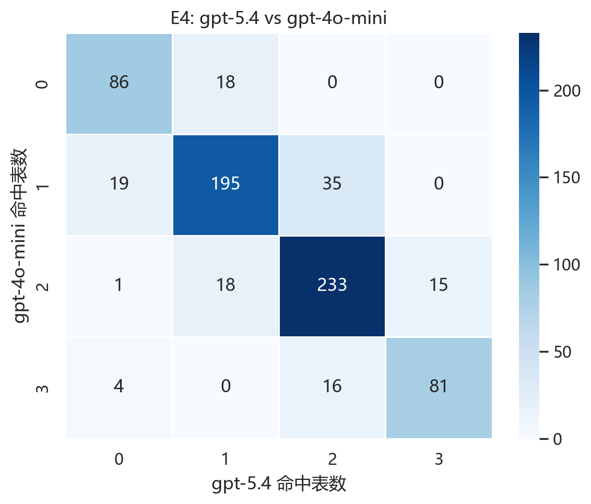

# three_table 问题分解器模型对比分析

- 基线模型：`gpt-4o-mini`
- 对比模型：`gpt-5.4`
- 本报告实际使用的评估 Top-K：`3`

## 一、核心结论

- 从 Recall 看，问题分解器替换带来的**最大正向收益**出现在 `E1`，由 0.3685 提升到 0.3773，变化 +0.0088。
- 从 MRR 看，排序质量提升最明显的也是 `E1`，由 0.6130 提升到 0.6251，变化 +0.0120。
- 并非所有检索策略都会因更换问题分解器而收益；在 `E3` 中，Recall 反而从 0.5141 下降到 0.5109，变化 -0.0032。
- 在 `E2, E3, E4` 中，两种问题分解器的整体表现接近，说明后续检索与传播机制对分解器差异具有一定缓冲作用。

## 二、按实验汇总的问题分解器差异

| 实验 | 设置 | Recall (gpt-4o-mini) | Recall (gpt-5.4) | Recall 差值 | Precision (gpt-4o-mini) | Precision (gpt-5.4) | Precision 差值 | F1 (gpt-4o-mini) | F1 (gpt-5.4) | F1 差值 | MRR (gpt-4o-mini) | MRR (gpt-5.4) | MRR 差值 | MAP@k (gpt-4o-mini) | MAP@k (gpt-5.4) | MAP@k 差值 | 平均首个命中排名 (gpt-4o-mini) | 平均首个命中排名 (gpt-5.4) | 首个命中排名差值 | 平均命中表数 (gpt-4o-mini) | 平均命中表数 (gpt-5.4) | 命中表数差值 |
| --- | --- | --- | --- | --- | --- | --- | --- | --- | --- | --- | --- | --- | --- | --- | --- | --- | --- | --- | --- | --- | --- | --- |
| E2 | 完整 MTR | 0.5081 | 0.5090 | 0.0009 | 0.5081 | 0.5090 | 0.0009 | 0.5081 | 0.5090 | 0.0009 | 0.7779 | 0.7799 | 0.0021 | 0.4500 | 0.4537 | 0.0037 | 1.2846 | 1.2520 | -0.0326 | 1.5243 | 1.5270 | 0.0028 |
| E1 | 完整 MTR（paper-like） | 0.3685 | 0.3773 | 0.0088 | 0.3685 | 0.3773 | 0.0088 | 0.3685 | 0.3773 | 0.0088 | 0.6130 | 0.6251 | 0.0120 | 0.3263 | 0.3293 | 0.0030 | 1.2707 | 1.3035 | 0.0328 | 1.1054 | 1.1318 | 0.0264 |
| E3 | Hybrid：不确定性门控传播 | 0.5141 | 0.5109 | -0.0032 | 0.5141 | 0.5109 | -0.0032 | 0.5141 | 0.5109 | -0.0032 | 0.7908 | 0.7890 | -0.0018 | 0.4585 | 0.4573 | -0.0012 | 1.2590 | 1.2369 | -0.0221 | 1.5423 | 1.5326 | -0.0097 |
| E4 | Hybrid：局部扩展 + 重排 | 0.5021 | 0.5025 | 0.0005 | 0.5021 | 0.5025 | 0.0005 | 0.5021 | 0.5025 | 0.0005 | 0.7753 | 0.7716 | -0.0037 | 0.4530 | 0.4524 | -0.0005 | 1.2237 | 1.2160 | -0.0076 | 1.5062 | 1.5076 | 0.0014 |

### 各实验指标柱状图

#### E2 指标对比

#### E1 指标对比

#### E3 指标对比

#### E4 指标对比

## 三、逐题层面的差异统计

| 对比实验 | 改善题数 | 退化题数 | 持平题数 | 平均 Recall 变化 | 平均 MRR 变化 | 平均命中表数变化 |
| --- | --- | --- | --- | --- | --- | --- |
| E2: gpt-5.4 vs gpt-4o-mini | 71 | 59 | 591 | 0.0009 | 0.0021 | 0.0028 |
| E1: gpt-5.4 vs gpt-4o-mini | 141 | 121 | 459 | 0.0088 | 0.0120 | 0.0264 |
| E3: gpt-5.4 vs gpt-4o-mini | 44 | 42 | 635 | -0.0032 | -0.0018 | -0.0097 |
| E4: gpt-5.4 vs gpt-4o-mini | 68 | 58 | 595 | 0.0005 | -0.0037 | 0.0014 |

## 四、实验 E2 中 `gpt-5.4` 相对 `gpt-4o-mini` 的逐题差异

- 对比实验：`E2: gpt-5.4 vs gpt-4o-mini`
- 改善题数：71
- 退化题数：59
- 持平题数：591
- 平均 Recall 变化：0.0009
- 平均 MRR 变化：0.0021
- 平均命中表数变化：0.0028

### 命中表数转移热力图

### 命中表数转移矩阵

| 命中表数转移 | 题数 |
| --- | --- |
| 2 -> 2 | 235 |
| 1 -> 1 | 210 |
| 3 -> 3 | 78 |
| 0 -> 0 | 68 |
| 1 -> 2 | 39 |
| 1 -> 0 | 21 |
| 0 -> 1 | 17 |
| 2 -> 1 | 17 |
| 2 -> 3 | 15 |
| 3 -> 2 | 14 |
| 3 -> 0 | 3 |
| 2 -> 0 | 2 |
| 3 -> 1 | 2 |

### 转移矩阵幅度分析

- 主对角线（命中表数不变）共有 591 题，占比 81.97%，说明大多数题目在更换问题分解器后保持稳定。
- 改善方向共有 71 题，占比 9.85%；其中小幅补表（如 0→1、1→2、2→3）为 71 题，大幅补表（如 0→2、0→3、1→3）为 0 题。
- 退化方向共有 59 题，占比 8.18%；其中小幅退化（如 3→2、2→1、1→0）为 52 题，大幅退化（如 3→1、3→0、2→0）为 7 题。
- 从幅度上看，当前转移矩阵以**大幅退化**更突出，说明虽然有题目改善，但少量严重退化样本会显著拉低总体平均指标。

### 改善题中的高频短语模式

| 模式 / 关键词 | 次数 |
| --- | --- |
| greater than | 7 |
| highest | 6 |
| who have | 3 |
| ordered by | 2 |
| both | 2 |
| less than | 2 |
| currently | 2 |
| who has | 1 |
| at least | 1 |
| along with | 1 |

### 退化题中的高频短语模式

| 模式 / 关键词 | 次数 |
| --- | --- |
| who have | 3 |
| greater than | 3 |
| at least | 2 |
| less than | 1 |
| currently | 1 |
| who has | 1 |
| highest | 1 |

### 改善题中的高频关键词

| 模式 / 关键词 | 次数 |
| --- | --- |
| students | 13 |
| account | 11 |
| author | 10 |
| city | 10 |
| greater | 9 |
| first | 8 |
| customers | 8 |
| last | 7 |
| paper | 7 |
| how | 6 |

### 退化题中的高频关键词

| 模式 / 关键词 | 次数 |
| --- | --- |
| students | 10 |
| how | 10 |
| many | 10 |
| customers | 8 |
| paper | 7 |
| located | 6 |
| city | 6 |
| customer | 6 |
| author | 6 |
| code | 5 |

### 代表性改善样例

- Q537: How many dorms with a student capacity greater than 100 have the amenity 'Pub in Basement'? | 命中表数 2 -> 3 | Recall 0.6667 -> 1.0000 | MRR 0.5000 -> 1.0000
- Q18: How many distinct students older than 18 have allergies classified as animal-related? | 命中表数 2 -> 3 | Recall 0.6667 -> 1.0000 | MRR 1.0000 -> 1.0000
- Q104: Who has more than 100000 in savings and also more than 5000 in checking account? | 命中表数 2 -> 3 | Recall 0.6667 -> 1.0000 | MRR 1.0000 -> 1.0000
- Q114: Which account holders have savings balance greater than 50000 but checking account balance less than 5000? | 命中表数 2 -> 3 | Recall 0.6667 -> 1.0000 | MRR 1.0000 -> 1.0000
- Q129: Which buildings host institutions that have proteins with sequence lengths exceeding 1800 and are taller than 250 feet? | 命中表数 2 -> 3 | Recall 0.6667 -> 1.0000 | MRR 1.0000 -> 1.0000
- Q190: Which party theme had a host with Hungarian nationality serving as the main in charge? | 命中表数 2 -> 3 | Recall 0.6667 -> 1.0000 | MRR 1.0000 -> 1.0000
- Q222: What is the title of the paper where the author Ralf Hinze has the highest authorship order (closest to first author)? | 命中表数 2 -> 3 | Recall 0.6667 -> 1.0000 | MRR 1.0000 -> 1.0000
- Q265: List the first name and last name of engineers who had engineer visits with status 'Fixed' and who were contacted by ... | 命中表数 2 -> 3 | Recall 0.6667 -> 1.0000 | MRR 1.0000 -> 1.0000
- Q353: List the names of physicians whose training certifications expire on '2008-12-31' and who are trained in performing p... | 命中表数 2 -> 3 | Recall 0.6667 -> 1.0000 | MRR 1.0000 -> 1.0000
- Q363: List the names of all patients who were prescribed the medication 'Thesisin' with a dose of 5. | 命中表数 2 -> 3 | Recall 0.6667 -> 1.0000 | MRR 1.0000 -> 1.0000

### 代表性退化样例

- Q210: Who is the primary author of the paper titled 'Functional Pearl: Modular Rollback through Control Logging'? | 命中表数 3 -> 0 | Recall 1.0000 -> 0.0000 | MRR 1.0000 -> 0.0000
- Q211: Who is the first-listed author of the paper titled 'Functional Pearl: Modular Rollback through Control Logging'? | 命中表数 3 -> 0 | Recall 1.0000 -> 0.0000 | MRR 1.0000 -> 0.0000
- Q213: Who is the primary author of the paper titled 'Functional Pearl: Modular Rollback through Control Logging'? | 命中表数 3 -> 0 | Recall 1.0000 -> 0.0000 | MRR 1.0000 -> 0.0000
- Q22: How many students under 20 years old have allergies categorized as 'animal'? | 命中表数 3 -> 1 | Recall 1.0000 -> 0.3333 | MRR 1.0000 -> 1.0000
- Q24: What are the names of students younger than 20 years old from city code 'BAL' who have environmental allergies? | 命中表数 3 -> 1 | Recall 1.0000 -> 0.3333 | MRR 1.0000 -> 1.0000
- Q20: List the names of students located in 'PIT' who have an animal-related allergy. | 命中表数 2 -> 0 | Recall 0.6667 -> 0.0000 | MRR 1.0000 -> 0.0000
- Q212: Who are the authors of the paper titled 'Functional Pearl: Modular Rollback through Control Logging'? | 命中表数 2 -> 0 | Recall 0.6667 -> 0.0000 | MRR 1.0000 -> 0.0000
- Q54: How many different phone companies manufactured devices using a chip model that supports WiFi '802.11b' and utilizing... | 命中表数 3 -> 2 | Recall 1.0000 -> 0.6667 | MRR 1.0000 -> 1.0000
- Q124: Which web client accelerators compatible with Firefox since 2007 or earlier support wireless connections? | 命中表数 3 -> 2 | Recall 1.0000 -> 0.6667 | MRR 1.0000 -> 1.0000
- Q136: Which USA-headquartered company has the most gas stations according to the provided data, and how many stations does ... | 命中表数 3 -> 2 | Recall 1.0000 -> 0.6667 | MRR 1.0000 -> 1.0000

## 四、实验 E1 中 `gpt-5.4` 相对 `gpt-4o-mini` 的逐题差异

- 对比实验：`E1: gpt-5.4 vs gpt-4o-mini`
- 改善题数：141
- 退化题数：121
- 持平题数：459
- 平均 Recall 变化：0.0088
- 平均 MRR 变化：0.0120
- 平均命中表数变化：0.0264

### 命中表数转移热力图

### 命中表数转移矩阵

| 命中表数转移 | 题数 |
| --- | --- |
| 1 -> 1 | 154 |
| 0 -> 0 | 148 |
| 2 -> 2 | 124 |
| 0 -> 1 | 58 |
| 1 -> 2 | 52 |
| 2 -> 1 | 41 |
| 1 -> 0 | 35 |
| 3 -> 3 | 33 |
| 2 -> 0 | 23 |
| 0 -> 2 | 17 |
| 3 -> 2 | 15 |
| 1 -> 3 | 7 |
| 3 -> 1 | 6 |
| 2 -> 3 | 4 |
| 0 -> 3 | 3 |
| 3 -> 0 | 1 |

### 转移矩阵幅度分析

- 主对角线（命中表数不变）共有 459 题，占比 63.66%，说明大多数题目在更换问题分解器后保持稳定。
- 改善方向共有 141 题，占比 19.56%；其中小幅补表（如 0→1、1→2、2→3）为 114 题，大幅补表（如 0→2、0→3、1→3）为 27 题。
- 退化方向共有 121 题，占比 16.78%；其中小幅退化（如 3→2、2→1、1→0）为 91 题，大幅退化（如 3→1、3→0、2→0）为 30 题。
- 从幅度上看，当前转移矩阵以**大幅退化**更突出，说明虽然有题目改善，但少量严重退化样本会显著拉低总体平均指标。

### 改善题中的高频短语模式

| 模式 / 关键词 | 次数 |
| --- | --- |
| greater than | 14 |
| at least | 10 |
| highest | 9 |
| who have | 5 |
| less than | 4 |
| both | 3 |
| who has | 3 |
| currently | 3 |
| along with | 2 |
| ordered by | 2 |

### 退化题中的高频短语模式

| 模式 / 关键词 | 次数 |
| --- | --- |
| highest | 15 |
| greater than | 6 |
| who have | 5 |
| at least | 3 |
| for which | 3 |
| along with | 2 |
| currently | 2 |
| both | 1 |
| at most | 1 |

### 改善题中的高频关键词

| 模式 / 关键词 | 次数 |
| --- | --- |
| students | 25 |
| account | 22 |
| located | 19 |
| how | 18 |
| many | 18 |
| customers | 18 |
| greater | 17 |
| savings | 16 |
| checking | 16 |
| balance | 15 |

### 退化题中的高频关键词

| 模式 / 关键词 | 次数 |
| --- | --- |
| average | 19 |
| students | 15 |
| highest | 15 |
| number | 14 |
| paper | 14 |
| titled | 12 |
| named | 11 |
| total | 11 |
| located | 11 |
| how | 11 |

### 代表性改善样例

- Q9: Who are the employees with salary above 200,000 certified to operate aircrafts having distance greater than 6000 miles? | 命中表数 0 -> 3 | Recall 0.0000 -> 1.0000 | MRR 0.0000 -> 1.0000
- Q17: List the names of the employees who are certified to fly aircraft capable of traveling more than 8000 miles and who h... | 命中表数 0 -> 3 | Recall 0.0000 -> 1.0000 | MRR 0.0000 -> 1.0000
- Q18: How many distinct students older than 18 have allergies classified as animal-related? | 命中表数 0 -> 3 | Recall 0.0000 -> 1.0000 | MRR 0.0000 -> 1.0000
- Q235: What is the title of the paper where author Ralf Hinze is listed as the first author? | 命中表数 1 -> 3 | Recall 0.3333 -> 1.0000 | MRR 0.3333 -> 1.0000
- Q46: Which FDA-approved medicines act as inhibitors on enzymes located in the Cytosol? | 命中表数 1 -> 3 | Recall 0.3333 -> 1.0000 | MRR 1.0000 -> 1.0000
- Q47: Which FDA-approved medicines activate enzymes that are located in the mitochondrion? | 命中表数 1 -> 3 | Recall 0.3333 -> 1.0000 | MRR 1.0000 -> 1.0000
- Q48: Which FDA-approved medicines act as activators for enzymes located in the Cytosol? | 命中表数 1 -> 3 | Recall 0.3333 -> 1.0000 | MRR 1.0000 -> 1.0000
- Q51: List the names of FDA-approved medicines that inhibit enzymes located in the mitochondrion. | 命中表数 1 -> 3 | Recall 0.3333 -> 1.0000 | MRR 1.0000 -> 1.0000
- Q178: What is the average rating given in January 2011 by reviewers who rated movies they directed? | 命中表数 1 -> 3 | Recall 0.3333 -> 1.0000 | MRR 1.0000 -> 1.0000
- Q655: What is the name of the longest bridge designed by Le Corbusier? | 命中表数 1 -> 3 | Recall 0.3333 -> 1.0000 | MRR 1.0000 -> 1.0000

### 代表性退化样例

- Q557: What is the dorm name and student capacity of dorms that allow pets and what is the average age of female students en... | 命中表数 3 -> 0 | Recall 1.0000 -> 0.0000 | MRR 1.0000 -> 0.0000
- Q692: Which template type description has the document with the highest version number? | 命中表数 3 -> 1 | Recall 1.0000 -> 0.3333 | MRR 1.0000 -> 0.3333
- Q109: What is the total combined balance from both savings and checking accounts of customers named Brown, Wang, and Granger? | 命中表数 3 -> 1 | Recall 1.0000 -> 0.3333 | MRR 1.0000 -> 0.5000
- Q313: List the names of manufacturers opened after year 2000 that produce furniture items with more than 10 components. | 命中表数 3 -> 1 | Recall 1.0000 -> 0.3333 | MRR 1.0000 -> 1.0000
- Q149: What are the names and years of all races that had a driver with the last name Lewis? | 命中表数 3 -> 1 | Recall 1.0000 -> 0.3333 | MRR 1.0000 -> 1.0000
- Q156: Find the id, forename and number of races of all drivers who have at least participated in two races? | 命中表数 3 -> 1 | Recall 1.0000 -> 0.3333 | MRR 1.0000 -> 1.0000
- Q160: Find the id and surname of the driver who participated the most number of races? | 命中表数 3 -> 1 | Recall 1.0000 -> 0.3333 | MRR 1.0000 -> 1.0000
- Q6: What country did the student John live in? | 命中表数 2 -> 0 | Recall 0.6667 -> 0.0000 | MRR 1.0000 -> 0.0000
- Q23: List the first and last names of students from NYC who have animal-related allergies. | 命中表数 2 -> 0 | Recall 0.6667 -> 0.0000 | MRR 1.0000 -> 0.0000
- Q186: Who are the main hosts in charge of parties hosted at Heineken Music Hall Amsterdam, and what are their nationalities? | 命中表数 2 -> 0 | Recall 0.6667 -> 0.0000 | MRR 1.0000 -> 0.0000

## 四、实验 E3 中 `gpt-5.4` 相对 `gpt-4o-mini` 的逐题差异

- 对比实验：`E3: gpt-5.4 vs gpt-4o-mini`
- 改善题数：44
- 退化题数：42
- 持平题数：635
- 平均 Recall 变化：-0.0032
- 平均 MRR 变化：-0.0018
- 平均命中表数变化：-0.0097

### 命中表数转移热力图

### 命中表数转移矩阵

| 命中表数转移 | 题数 |
| --- | --- |
| 2 -> 2 | 260 |
| 1 -> 1 | 219 |
| 3 -> 3 | 87 |
| 0 -> 0 | 69 |
| 1 -> 2 | 23 |
| 1 -> 0 | 19 |
| 0 -> 1 | 15 |
| 2 -> 1 | 10 |
| 3 -> 2 | 7 |
| 2 -> 3 | 6 |
| 3 -> 0 | 3 |
| 3 -> 1 | 2 |
| 2 -> 0 | 1 |

### 转移矩阵幅度分析

- 主对角线（命中表数不变）共有 635 题，占比 88.07%，说明大多数题目在更换问题分解器后保持稳定。
- 改善方向共有 44 题，占比 6.10%；其中小幅补表（如 0→1、1→2、2→3）为 44 题，大幅补表（如 0→2、0→3、1→3）为 0 题。
- 退化方向共有 42 题，占比 5.83%；其中小幅退化（如 3→2、2→1、1→0）为 36 题，大幅退化（如 3→1、3→0、2→0）为 6 题。
- 从幅度上看，当前转移矩阵以**大幅退化**更突出，说明虽然有题目改善，但少量严重退化样本会显著拉低总体平均指标。

### 改善题中的高频短语模式

| 模式 / 关键词 | 次数 |
| --- | --- |
| highest | 4 |
| who have | 3 |
| greater than | 2 |
| both | 1 |
| ordered by | 1 |
| at least | 1 |
| along with | 1 |
| currently | 1 |
| at most | 1 |

### 退化题中的高频短语模式

| 模式 / 关键词 | 次数 |
| --- | --- |
| greater than | 3 |
| who have | 2 |
| at least | 1 |
| currently | 1 |
| who has | 1 |
| highest | 1 |

### 改善题中的高频关键词

| 模式 / 关键词 | 次数 |
| --- | --- |
| students | 13 |
| author | 8 |
| city | 8 |
| how | 5 |
| many | 5 |
| first | 5 |
| last | 5 |
| average | 5 |
| paper | 5 |
| code | 5 |

### 退化题中的高频关键词

| 模式 / 关键词 | 次数 |
| --- | --- |
| students | 7 |
| paper | 7 |
| how | 6 |
| many | 6 |
| author | 6 |
| customers | 6 |
| city | 5 |
| code | 5 |
| first | 5 |
| titled | 5 |

### 代表性改善样例

- Q537: How many dorms with a student capacity greater than 100 have the amenity 'Pub in Basement'? | 命中表数 2 -> 3 | Recall 0.6667 -> 1.0000 | MRR 0.5000 -> 1.0000
- Q18: How many distinct students older than 18 have allergies classified as animal-related? | 命中表数 2 -> 3 | Recall 0.6667 -> 1.0000 | MRR 1.0000 -> 1.0000
- Q222: What is the title of the paper where the author Ralf Hinze has the highest authorship order (closest to first author)? | 命中表数 2 -> 3 | Recall 0.6667 -> 1.0000 | MRR 1.0000 -> 1.0000
- Q265: List the first name and last name of engineers who had engineer visits with status 'Fixed' and who were contacted by ... | 命中表数 2 -> 3 | Recall 0.6667 -> 1.0000 | MRR 1.0000 -> 1.0000
- Q709: What is the name of the city with the largest population among the countries whose official or spoken language is Por... | 命中表数 2 -> 3 | Recall 0.6667 -> 1.0000 | MRR 1.0000 -> 1.0000
- Q158: Find the driver id and number of races of all drivers who have at most participated in 30 races? | 命中表数 2 -> 3 | Recall 0.6667 -> 1.0000 | MRR 1.0000 -> 1.0000
- Q89: What is the total amount spent by customer with customer_id '5' on all their orders? | 命中表数 0 -> 1 | Recall 0.0000 -> 0.3333 | MRR 0.0000 -> 1.0000
- Q204: What is the average age of students who visited the restaurant named Subway? | 命中表数 0 -> 1 | Recall 0.0000 -> 0.3333 | MRR 0.0000 -> 1.0000
- Q215: Which country is the institution affiliated with the author Stephanie Weirich located in? | 命中表数 0 -> 1 | Recall 0.0000 -> 0.3333 | MRR 0.0000 -> 1.0000
- Q406: How many students from city code 'BAL' are members of the club 'Bootup Baltimore'? | 命中表数 0 -> 1 | Recall 0.0000 -> 0.3333 | MRR 0.0000 -> 1.0000

### 代表性退化样例

- Q210: Who is the primary author of the paper titled 'Functional Pearl: Modular Rollback through Control Logging'? | 命中表数 3 -> 0 | Recall 1.0000 -> 0.0000 | MRR 1.0000 -> 0.0000
- Q211: Who is the first-listed author of the paper titled 'Functional Pearl: Modular Rollback through Control Logging'? | 命中表数 3 -> 0 | Recall 1.0000 -> 0.0000 | MRR 1.0000 -> 0.0000
- Q213: Who is the primary author of the paper titled 'Functional Pearl: Modular Rollback through Control Logging'? | 命中表数 3 -> 0 | Recall 1.0000 -> 0.0000 | MRR 1.0000 -> 0.0000
- Q22: How many students under 20 years old have allergies categorized as 'animal'? | 命中表数 3 -> 1 | Recall 1.0000 -> 0.3333 | MRR 1.0000 -> 1.0000
- Q24: What are the names of students younger than 20 years old from city code 'BAL' who have environmental allergies? | 命中表数 3 -> 1 | Recall 1.0000 -> 0.3333 | MRR 1.0000 -> 1.0000
- Q212: Who are the authors of the paper titled 'Functional Pearl: Modular Rollback through Control Logging'? | 命中表数 2 -> 0 | Recall 0.6667 -> 0.0000 | MRR 1.0000 -> 0.0000
- Q145: How many distinct aircraft, ordered after 1996, have been piloted by pilots in the 'Center Team' position? | 命中表数 3 -> 2 | Recall 1.0000 -> 0.6667 | MRR 1.0000 -> 1.0000
- Q208: Which author has contributed to exactly two papers and is listed as the first author on one paper titled 'Proving the... | 命中表数 3 -> 2 | Recall 1.0000 -> 0.6667 | MRR 1.0000 -> 1.0000
- Q423: How many tasks belong to projects initiated by organisation 3 and have produced a paper outcome? | 命中表数 3 -> 2 | Recall 1.0000 -> 0.6667 | MRR 1.0000 -> 1.0000
- Q430: What kinds of research outcomes have been generated by projects conducted by the organisation with ID 1? | 命中表数 3 -> 2 | Recall 1.0000 -> 0.6667 | MRR 1.0000 -> 1.0000

## 四、实验 E4 中 `gpt-5.4` 相对 `gpt-4o-mini` 的逐题差异

- 对比实验：`E4: gpt-5.4 vs gpt-4o-mini`
- 改善题数：68
- 退化题数：58
- 持平题数：595
- 平均 Recall 变化：0.0005
- 平均 MRR 变化：-0.0037
- 平均命中表数变化：0.0014

### 命中表数转移热力图

### 命中表数转移矩阵

| 命中表数转移 | 题数 |
| --- | --- |
| 2 -> 2 | 233 |
| 1 -> 1 | 195 |
| 0 -> 0 | 86 |
| 3 -> 3 | 81 |
| 1 -> 2 | 35 |
| 1 -> 0 | 19 |
| 0 -> 1 | 18 |
| 2 -> 1 | 18 |
| 3 -> 2 | 16 |
| 2 -> 3 | 15 |
| 3 -> 0 | 4 |
| 2 -> 0 | 1 |

### 转移矩阵幅度分析

- 主对角线（命中表数不变）共有 595 题，占比 82.52%，说明大多数题目在更换问题分解器后保持稳定。
- 改善方向共有 68 题，占比 9.43%；其中小幅补表（如 0→1、1→2、2→3）为 68 题，大幅补表（如 0→2、0→3、1→3）为 0 题。
- 退化方向共有 58 题，占比 8.04%；其中小幅退化（如 3→2、2→1、1→0）为 53 题，大幅退化（如 3→1、3→0、2→0）为 5 题。
- 从幅度上看，当前转移矩阵以**大幅退化**更突出，说明虽然有题目改善，但少量严重退化样本会显著拉低总体平均指标。

### 改善题中的高频短语模式

| 模式 / 关键词 | 次数 |
| --- | --- |
| greater than | 7 |
| highest | 6 |
| ordered by | 2 |
| both | 2 |
| who have | 2 |
| less than | 2 |
| along with | 2 |
| currently | 2 |
| who has | 1 |
| at least | 1 |

### 退化题中的高频短语模式

| 模式 / 关键词 | 次数 |
| --- | --- |
| who have | 3 |
| greater than | 3 |
| who has | 2 |
| highest | 2 |
| at least | 2 |
| less than | 1 |
| currently | 1 |

### 改善题中的高频关键词

| 模式 / 关键词 | 次数 |
| --- | --- |
| account | 11 |
| students | 10 |
| author | 10 |
| greater | 9 |
| city | 9 |
| customers | 8 |
| first | 7 |
| paper | 7 |
| last | 6 |
| savings | 6 |

### 退化题中的高频关键词

| 模式 / 关键词 | 次数 |
| --- | --- |
| students | 10 |
| how | 9 |
| many | 9 |
| customers | 8 |
| located | 7 |
| paper | 7 |
| first | 6 |
| city | 6 |
| customer | 6 |
| author | 6 |

### 代表性改善样例

- Q537: How many dorms with a student capacity greater than 100 have the amenity 'Pub in Basement'? | 命中表数 2 -> 3 | Recall 0.6667 -> 1.0000 | MRR 0.5000 -> 1.0000
- Q25: Find the first and last names of students who have both animal and food allergies. | 命中表数 2 -> 3 | Recall 0.6667 -> 1.0000 | MRR 1.0000 -> 1.0000
- Q104: Who has more than 100000 in savings and also more than 5000 in checking account? | 命中表数 2 -> 3 | Recall 0.6667 -> 1.0000 | MRR 1.0000 -> 1.0000
- Q114: Which account holders have savings balance greater than 50000 but checking account balance less than 5000? | 命中表数 2 -> 3 | Recall 0.6667 -> 1.0000 | MRR 1.0000 -> 1.0000
- Q129: Which buildings host institutions that have proteins with sequence lengths exceeding 1800 and are taller than 250 feet? | 命中表数 2 -> 3 | Recall 0.6667 -> 1.0000 | MRR 1.0000 -> 1.0000
- Q190: Which party theme had a host with Hungarian nationality serving as the main in charge? | 命中表数 2 -> 3 | Recall 0.6667 -> 1.0000 | MRR 1.0000 -> 1.0000
- Q222: What is the title of the paper where the author Ralf Hinze has the highest authorship order (closest to first author)? | 命中表数 2 -> 3 | Recall 0.6667 -> 1.0000 | MRR 1.0000 -> 1.0000
- Q265: List the first name and last name of engineers who had engineer visits with status 'Fixed' and who were contacted by ... | 命中表数 2 -> 3 | Recall 0.6667 -> 1.0000 | MRR 1.0000 -> 1.0000
- Q353: List the names of physicians whose training certifications expire on '2008-12-31' and who are trained in performing p... | 命中表数 2 -> 3 | Recall 0.6667 -> 1.0000 | MRR 1.0000 -> 1.0000
- Q363: List the names of all patients who were prescribed the medication 'Thesisin' with a dose of 5. | 命中表数 2 -> 3 | Recall 0.6667 -> 1.0000 | MRR 1.0000 -> 1.0000

### 代表性退化样例

- Q20: List the names of students located in 'PIT' who have an animal-related allergy. | 命中表数 3 -> 0 | Recall 1.0000 -> 0.0000 | MRR 1.0000 -> 0.0000
- Q210: Who is the primary author of the paper titled 'Functional Pearl: Modular Rollback through Control Logging'? | 命中表数 3 -> 0 | Recall 1.0000 -> 0.0000 | MRR 1.0000 -> 0.0000
- Q211: Who is the first-listed author of the paper titled 'Functional Pearl: Modular Rollback through Control Logging'? | 命中表数 3 -> 0 | Recall 1.0000 -> 0.0000 | MRR 1.0000 -> 0.0000
- Q213: Who is the primary author of the paper titled 'Functional Pearl: Modular Rollback through Control Logging'? | 命中表数 3 -> 0 | Recall 1.0000 -> 0.0000 | MRR 1.0000 -> 0.0000
- Q212: Who are the authors of the paper titled 'Functional Pearl: Modular Rollback through Control Logging'? | 命中表数 2 -> 0 | Recall 0.6667 -> 0.0000 | MRR 1.0000 -> 0.0000
- Q22: How many students under 20 years old have allergies categorized as 'animal'? | 命中表数 3 -> 2 | Recall 1.0000 -> 0.6667 | MRR 1.0000 -> 1.0000
- Q24: What are the names of students younger than 20 years old from city code 'BAL' who have environmental allergies? | 命中表数 3 -> 2 | Recall 1.0000 -> 0.6667 | MRR 1.0000 -> 1.0000
- Q54: How many different phone companies manufactured devices using a chip model that supports WiFi '802.11b' and utilizing... | 命中表数 3 -> 2 | Recall 1.0000 -> 0.6667 | MRR 1.0000 -> 1.0000
- Q124: Which web client accelerators compatible with Firefox since 2007 or earlier support wireless connections? | 命中表数 3 -> 2 | Recall 1.0000 -> 0.6667 | MRR 1.0000 -> 1.0000
- Q136: Which USA-headquartered company has the most gas stations according to the provided data, and how many stations does ... | 命中表数 3 -> 2 | Recall 1.0000 -> 0.6667 | MRR 1.0000 -> 1.0000
