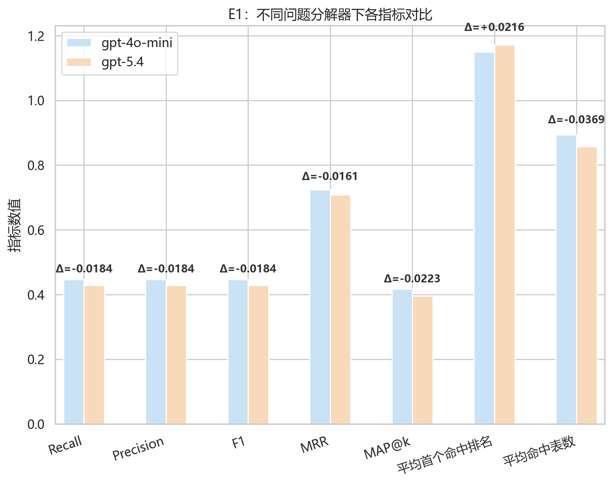
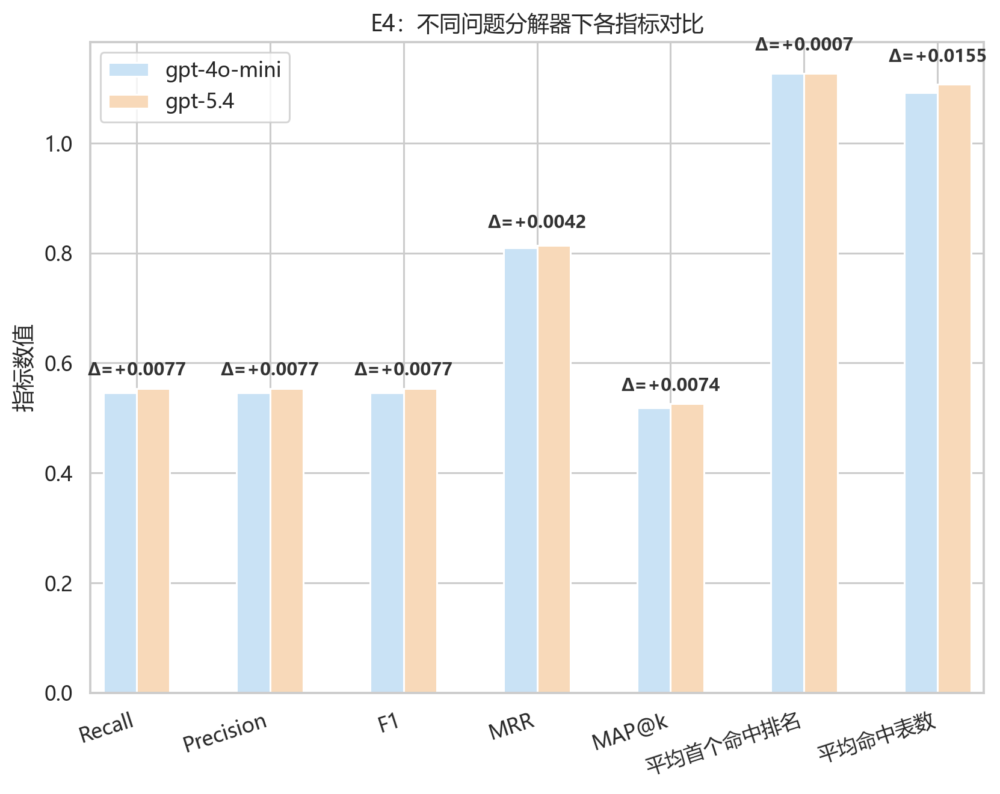
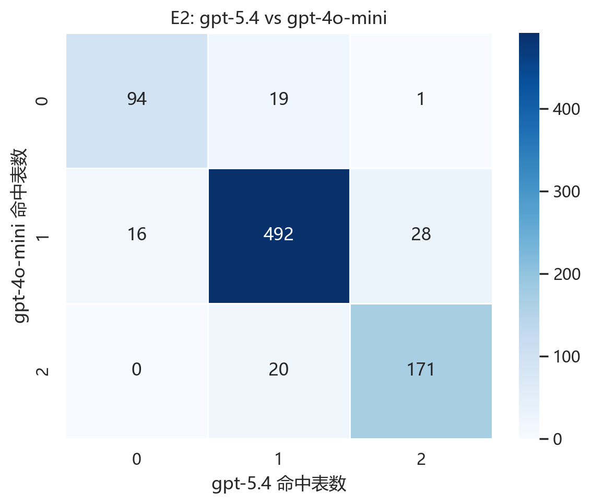
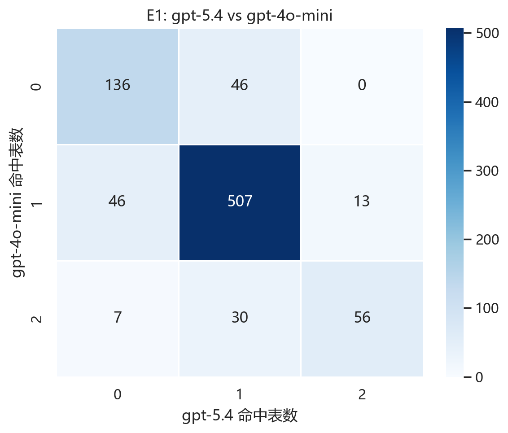
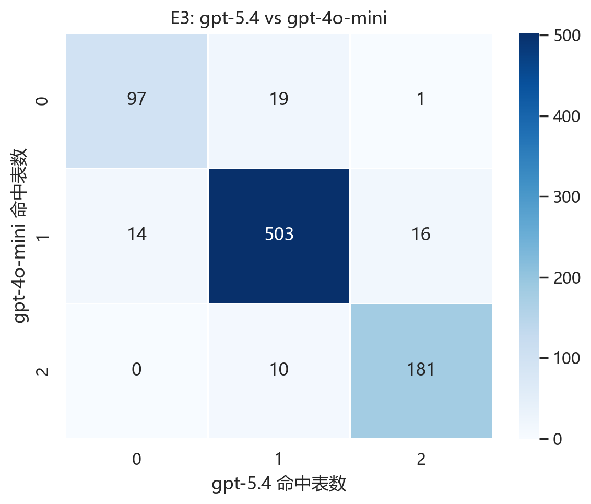

# two_table 问题分解器模型对比分析

- 基线模型：`gpt-4o-mini`
- 对比模型：`gpt-5.4`
- 本报告实际使用的评估 Top-K：`2`

## 一、核心结论

- 从 Recall 看，问题分解器替换带来的**最大正向收益**出现在 `E2`，由 0.5458 提升到 0.5535，变化 +0.0077。
- 从 MRR 看，排序质量提升最明显的也是 `E3`，由 0.8086 提升到 0.8151，变化 +0.0065。
- 并非所有检索策略都会因更换问题分解器而收益；在 `E1` 中，Recall 反而从 0.4471 下降到 0.4287，变化 -0.0184。

## 二、按实验汇总的问题分解器差异

| 实验 | 设置 | Recall (gpt-4o-mini) | Recall (gpt-5.4) | Recall 差值 | Precision (gpt-4o-mini) | Precision (gpt-5.4) | Precision 差值 | F1 (gpt-4o-mini) | F1 (gpt-5.4) | F1 差值 | MRR (gpt-4o-mini) | MRR (gpt-5.4) | MRR 差值 | MAP@k (gpt-4o-mini) | MAP@k (gpt-5.4) | MAP@k 差值 | 平均首个命中排名 (gpt-4o-mini) | 平均首个命中排名 (gpt-5.4) | 首个命中排名差值 | 平均命中表数 (gpt-4o-mini) | 平均命中表数 (gpt-5.4) | 命中表数差值 |
| --- | --- | --- | --- | --- | --- | --- | --- | --- | --- | --- | --- | --- | --- | --- | --- | --- | --- | --- | --- | --- | --- | --- |
| E2 | 完整 MTR | 0.5458 | 0.5535 | 0.0077 | 0.5458 | 0.5535 | 0.0077 | 0.5458 | 0.5535 | 0.0077 | 0.8098 | 0.8139 | 0.0042 | 0.5184 | 0.5259 | 0.0074 | 1.1265 | 1.1272 | 0.0007 | 1.0916 | 1.1070 | 0.0155 |
| E1 | 完整 MTR（paper-like） | 0.4471 | 0.4287 | -0.0184 | 0.4471 | 0.4287 | -0.0184 | 0.4471 | 0.4287 | -0.0184 | 0.7247 | 0.7087 | -0.0161 | 0.4177 | 0.3954 | -0.0223 | 1.1502 | 1.1718 | 0.0216 | 0.8942 | 0.8573 | -0.0369 |
| E3 | Hybrid：不确定性门控传播 | 0.5440 | 0.5517 | 0.0077 | 0.5440 | 0.5517 | 0.0077 | 0.5440 | 0.5517 | 0.0077 | 0.8086 | 0.8151 | 0.0065 | 0.5178 | 0.5253 | 0.0074 | 1.1215 | 1.1219 | 0.0004 | 1.0880 | 1.1034 | 0.0155 |
| E4 | Hybrid：局部扩展 + 重排 | 0.5458 | 0.5535 | 0.0077 | 0.5458 | 0.5535 | 0.0077 | 0.5458 | 0.5535 | 0.0077 | 0.8098 | 0.8139 | 0.0042 | 0.5184 | 0.5259 | 0.0074 | 1.1265 | 1.1272 | 0.0007 | 1.0916 | 1.1070 | 0.0155 |

### 各实验指标柱状图

#### E2 指标对比

#### E1 指标对比

#### E3 指标对比

#### E4 指标对比

## 三、逐题层面的差异统计

| 对比实验 | 改善题数 | 退化题数 | 持平题数 | 平均 Recall 变化 | 平均 MRR 变化 | 平均命中表数变化 |
| --- | --- | --- | --- | --- | --- | --- |
| E2: gpt-5.4 vs gpt-4o-mini | 48 | 36 | 757 | 0.0077 | 0.0042 | 0.0155 |
| E1: gpt-5.4 vs gpt-4o-mini | 59 | 83 | 699 | -0.0184 | -0.0161 | -0.0369 |
| E3: gpt-5.4 vs gpt-4o-mini | 36 | 24 | 781 | 0.0077 | 0.0065 | 0.0155 |
| E4: gpt-5.4 vs gpt-4o-mini | 48 | 36 | 757 | 0.0077 | 0.0042 | 0.0155 |

## 四、实验 E2 中 `gpt-5.4` 相对 `gpt-4o-mini` 的逐题差异

- 对比实验：`E2: gpt-5.4 vs gpt-4o-mini`
- 改善题数：48
- 退化题数：36
- 持平题数：757
- 平均 Recall 变化：0.0077
- 平均 MRR 变化：0.0042
- 平均命中表数变化：0.0155

### 命中表数转移热力图

### 命中表数转移矩阵

| 命中表数转移 | 题数 |
| --- | --- |
| 1 -> 1 | 492 |
| 2 -> 2 | 171 |
| 0 -> 0 | 94 |
| 1 -> 2 | 28 |
| 2 -> 1 | 20 |
| 0 -> 1 | 19 |
| 1 -> 0 | 16 |
| 0 -> 2 | 1 |

### 转移矩阵幅度分析

- 主对角线（命中表数不变）共有 757 题，占比 90.01%，说明大多数题目在更换问题分解器后保持稳定。
- 改善方向共有 48 题，占比 5.71%；其中小幅补表（如 0→1、1→2、2→3）为 47 题，大幅补表（如 0→2、0→3、1→3）为 1 题。
- 退化方向共有 36 题，占比 4.28%；其中小幅退化（如 3→2、2→1、1→0）为 36 题，大幅退化（如 3→1、3→0、2→0）为 0 题。
- 从幅度上看，当前转移矩阵以**大幅补表增益**更突出，说明新分解器在部分复杂题上能显著补回原本遗漏的相关表。

### 改善题中的高频短语模式

| 模式 / 关键词 | 次数 |
| --- | --- |
| highest | 8 |
| who have | 3 |
| greater than | 3 |
| at least | 1 |
| currently | 1 |

### 退化题中的高频短语模式

| 模式 / 关键词 | 次数 |
| --- | --- |
| greater than | 5 |
| who have | 3 |
| highest | 3 |
| both | 2 |
| along with | 1 |
| at least | 1 |
| currently | 1 |

### 改善题中的高频关键词

| 模式 / 关键词 | 次数 |
| --- | --- |
| customers | 8 |
| highest | 8 |
| january | 7 |
| policy | 7 |
| rating | 7 |
| type | 6 |
| how | 5 |
| many | 5 |
| average | 5 |
| movies | 5 |

### 退化题中的高频关键词

| 模式 / 关键词 | 次数 |
| --- | --- |
| how | 9 |
| many | 9 |
| customers | 7 |
| greater | 5 |
| loan | 5 |
| unique | 4 |
| students | 4 |
| total | 4 |
| account | 4 |
| march | 4 |

### 代表性改善样例

- Q109: List the product names and their prices in dollars from the catalog entries that have an attribute ID 3 set as '1' an... | 命中表数 0 -> 2 | Recall 0.0000 -> 1.0000 | MRR 0.0000 -> 1.0000
- Q208: How many valid debit cards are associated with customers with the last name 'Effertz'? | 命中表数 0 -> 1 | Recall 0.0000 -> 0.5000 | MRR 0.0000 -> 1.0000
- Q344: Which team has the highest number of players from UCLA according to the available data? | 命中表数 0 -> 1 | Recall 0.0000 -> 0.5000 | MRR 0.0000 -> 1.0000
- Q483: Which customers have had 'Uniformed' policies ending between January 1st, 2018 and February 1st, 2018? | 命中表数 0 -> 1 | Recall 0.0000 -> 0.5000 | MRR 0.0000 -> 1.0000
- Q492: Who are the customers that started a 'Uniformed' policy before the year 2017? | 命中表数 0 -> 1 | Recall 0.0000 -> 0.5000 | MRR 0.0000 -> 1.0000
- Q493: How many distinct policy types has the customer named Dr. Diana Rath purchased? | 命中表数 0 -> 1 | Recall 0.0000 -> 0.5000 | MRR 0.0000 -> 1.0000
- Q500: Which customers have a 'Uniformed' policy type that expired after the date '2018-01-01'? | 命中表数 0 -> 1 | Recall 0.0000 -> 0.5000 | MRR 0.0000 -> 1.0000
- Q530: How many unique customers placed orders after January 1, 2017, that later had invoices issued? | 命中表数 0 -> 1 | Recall 0.0000 -> 0.5000 | MRR 0.0000 -> 1.0000
- Q833: Which reviewer gave the highest average star rating for movies rated between January 1, 2011, and January 20, 2011? | 命中表数 0 -> 1 | Recall 0.0000 -> 0.5000 | MRR 0.0000 -> 1.0000
- Q110: What is the average price in dollars of products whose parent entries are sub-categories priced above 700 dollars? | 命中表数 0 -> 1 | Recall 0.0000 -> 0.5000 | MRR 0.0000 -> 0.5000

### 代表性退化样例

- Q135: List the unique first and last names of students who are allergic to nuts and are younger than 20. | 命中表数 1 -> 0 | Recall 0.5000 -> 0.0000 | MRR 1.0000 -> 0.0000
- Q144: Who are the students living in city HKG that have an allergy to Soy? | 命中表数 1 -> 0 | Recall 0.5000 -> 0.0000 | MRR 1.0000 -> 0.0000
- Q528: How many distinct customers placed orders which have invoices dated between March 1, 2018 and March 20, 2018? | 命中表数 1 -> 0 | Recall 0.5000 -> 0.0000 | MRR 1.0000 -> 0.0000
- Q1017: What is the name of the maintenance contractor company responsible for maintaining the assets with make 'RU' that hav... | 命中表数 1 -> 0 | Recall 0.5000 -> 0.0000 | MRR 1.0000 -> 0.0000
- Q14: What is the mobile number of the person whose candidate details indicate 'Alex'? | 命中表数 1 -> 0 | Recall 0.5000 -> 0.0000 | MRR 0.5000 -> 0.0000
- Q31: How many unique people started living at addresses in SouthDakota before the year 2011? | 命中表数 1 -> 0 | Recall 0.5000 -> 0.0000 | MRR 0.5000 -> 0.0000
- Q157: What is the total amount spent by all customers located in Germany? | 命中表数 1 -> 0 | Recall 0.5000 -> 0.0000 | MRR 0.5000 -> 0.0000
- Q192: What is the email address of the customer who owns the account named '546'? | 命中表数 1 -> 0 | Recall 0.5000 -> 0.0000 | MRR 0.5000 -> 0.0000
- Q199: How many customers residing in NH have VIP accounts? | 命中表数 1 -> 0 | Recall 0.5000 -> 0.0000 | MRR 0.5000 -> 0.0000
- Q211: What are the first and last names of customers whose credit cards expired between March 1, 2018, and March 20, 2018? | 命中表数 1 -> 0 | Recall 0.5000 -> 0.0000 | MRR 0.5000 -> 0.0000

## 四、实验 E1 中 `gpt-5.4` 相对 `gpt-4o-mini` 的逐题差异

- 对比实验：`E1: gpt-5.4 vs gpt-4o-mini`
- 改善题数：59
- 退化题数：83
- 持平题数：699
- 平均 Recall 变化：-0.0184
- 平均 MRR 变化：-0.0161
- 平均命中表数变化：-0.0369

### 命中表数转移热力图

### 命中表数转移矩阵

| 命中表数转移 | 题数 |
| --- | --- |
| 1 -> 1 | 507 |
| 0 -> 0 | 136 |
| 2 -> 2 | 56 |
| 0 -> 1 | 46 |
| 1 -> 0 | 46 |
| 2 -> 1 | 30 |
| 1 -> 2 | 13 |
| 2 -> 0 | 7 |

### 转移矩阵幅度分析

- 主对角线（命中表数不变）共有 699 题，占比 83.12%，说明大多数题目在更换问题分解器后保持稳定。
- 改善方向共有 59 题，占比 7.02%；其中小幅补表（如 0→1、1→2、2→3）为 59 题，大幅补表（如 0→2、0→3、1→3）为 0 题。
- 退化方向共有 83 题，占比 9.87%；其中小幅退化（如 3→2、2→1、1→0）为 76 题，大幅退化（如 3→1、3→0、2→0）为 7 题。
- 从幅度上看，当前转移矩阵以**大幅退化**更突出，说明虽然有题目改善，但少量严重退化样本会显著拉低总体平均指标。

### 改善题中的高频短语模式

| 模式 / 关键词 | 次数 |
| --- | --- |
| highest | 15 |
| at least | 4 |
| earliest | 1 |
| less than | 1 |
| greater than | 1 |

### 退化题中的高频短语模式

| 模式 / 关键词 | 次数 |
| --- | --- |
| highest | 12 |
| at least | 7 |
| greater than | 6 |
| currently | 4 |
| who have | 3 |
| earliest | 3 |
| both | 1 |
| latest | 1 |
| ordered by | 1 |

### 改善题中的高频关键词

| 模式 / 关键词 | 次数 |
| --- | --- |
| number | 15 |
| highest | 15 |
| policy | 10 |
| how | 9 |
| many | 9 |
| type | 9 |
| customers | 9 |
| january | 7 |
| customer | 7 |
| uniformed | 7 |

### 退化题中的高频关键词

| 模式 / 关键词 | 次数 |
| --- | --- |
| rating | 16 |
| average | 15 |
| highest | 12 |
| how | 9 |
| many | 9 |
| songs | 9 |
| female | 9 |
| artists | 8 |
| total | 7 |
| number | 7 |

### 代表性改善样例

- Q16: Which students attended the course with ID 301 after January 1, 2010? | 命中表数 0 -> 1 | Recall 0.0000 -> 0.5000 | MRR 0.0000 -> 1.0000
- Q98: Who does Iron Man follow that has more than 1 million followers? | 命中表数 0 -> 1 | Recall 0.0000 -> 0.5000 | MRR 0.0000 -> 1.0000
- Q100: What are the names of the users followed by the user that Natalie Portman is following? | 命中表数 0 -> 1 | Recall 0.0000 -> 0.5000 | MRR 0.0000 -> 1.0000
- Q119: What are the flight number, origin, and destination for flights operated by Boeing 737-800 aircraft traveling more th... | 命中表数 0 -> 1 | Recall 0.0000 -> 0.5000 | MRR 0.0000 -> 1.0000
- Q124: Which employee or employees hold the highest number of certificates? | 命中表数 0 -> 1 | Recall 0.0000 -> 0.5000 | MRR 0.0000 -> 1.0000
- Q183: How many tracks are contained in the playlist named 'Music'? | 命中表数 0 -> 1 | Recall 0.0000 -> 0.5000 | MRR 0.0000 -> 1.0000
- Q209: Which customer holds the credit card that expires the earliest, and what is the card number and expiration date? | 命中表数 0 -> 1 | Recall 0.0000 -> 0.5000 | MRR 0.0000 -> 1.0000
- Q344: Which team has the highest number of players from UCLA according to the available data? | 命中表数 0 -> 1 | Recall 0.0000 -> 0.5000 | MRR 0.0000 -> 1.0000
- Q347: How many distinct players came from colleges Virginia and Maryland across all teams? | 命中表数 0 -> 1 | Recall 0.0000 -> 0.5000 | MRR 0.0000 -> 1.0000
- Q356: Which team had the highest number of players playing as defenders across all seasons? | 命中表数 0 -> 1 | Recall 0.0000 -> 0.5000 | MRR 0.0000 -> 1.0000

### 代表性退化样例

- Q299: Which enzymes located in the mitochondrion are inhibited by medicine with ID 2? | 命中表数 2 -> 0 | Recall 1.0000 -> 0.0000 | MRR 1.0000 -> 0.0000
- Q303: Which enzyme located in the Cytosol is activated by medicine with ID 20? | 命中表数 2 -> 0 | Recall 1.0000 -> 0.0000 | MRR 1.0000 -> 0.0000
- Q536: Which order IDs contain products categorized as 'DVDs' with 'Yellow' color having a quantity of at least 5? | 命中表数 2 -> 0 | Recall 1.0000 -> 0.0000 | MRR 1.0000 -> 0.0000
- Q649: What is the total amount paid using cash for bookings that are in Provisional status? | 命中表数 2 -> 0 | Recall 1.0000 -> 0.0000 | MRR 1.0000 -> 0.0000
- Q688: Which shipping agent has the most documents currently in 'working' status, and how many documents does it have? | 命中表数 2 -> 0 | Recall 1.0000 -> 0.0000 | MRR 1.0000 -> 0.0000
- Q690: What is the shipping agent description for the agent handling the most recent 'Hard Drive' document that is marked as... | 命中表数 2 -> 0 | Recall 1.0000 -> 0.0000 | MRR 1.0000 -> 0.0000
- Q1134: List the names of artists from India who sang Bangla songs with ratings greater than 7. | 命中表数 2 -> 0 | Recall 1.0000 -> 0.0000 | MRR 1.0000 -> 0.0000
- Q4: What are the names of cities or villages with populations below 2000 that hosted farm competitions between the years ... | 命中表数 1 -> 0 | Recall 0.5000 -> 0.0000 | MRR 1.0000 -> 0.0000
- Q145: How many students from city 'PIT' have allergies to either 'Shellfish' or 'Anchovies'? | 命中表数 1 -> 0 | Recall 0.5000 -> 0.0000 | MRR 1.0000 -> 0.0000
- Q202: What are the names of customers and their account names who have VIP accounts and reside in Kentucky (KY)? | 命中表数 1 -> 0 | Recall 0.5000 -> 0.0000 | MRR 1.0000 -> 0.0000

## 四、实验 E3 中 `gpt-5.4` 相对 `gpt-4o-mini` 的逐题差异

- 对比实验：`E3: gpt-5.4 vs gpt-4o-mini`
- 改善题数：36
- 退化题数：24
- 持平题数：781
- 平均 Recall 变化：0.0077
- 平均 MRR 变化：0.0065
- 平均命中表数变化：0.0155

### 命中表数转移热力图

### 命中表数转移矩阵

| 命中表数转移 | 题数 |
| --- | --- |
| 1 -> 1 | 503 |
| 2 -> 2 | 181 |
| 0 -> 0 | 97 |
| 0 -> 1 | 19 |
| 1 -> 2 | 16 |
| 1 -> 0 | 14 |
| 2 -> 1 | 10 |
| 0 -> 2 | 1 |

### 转移矩阵幅度分析

- 主对角线（命中表数不变）共有 781 题，占比 92.87%，说明大多数题目在更换问题分解器后保持稳定。
- 改善方向共有 36 题，占比 4.28%；其中小幅补表（如 0→1、1→2、2→3）为 35 题，大幅补表（如 0→2、0→3、1→3）为 1 题。
- 退化方向共有 24 题，占比 2.85%；其中小幅退化（如 3→2、2→1、1→0）为 24 题，大幅退化（如 3→1、3→0、2→0）为 0 题。
- 从幅度上看，当前转移矩阵以**大幅补表增益**更突出，说明新分解器在部分复杂题上能显著补回原本遗漏的相关表。

### 改善题中的高频短语模式

| 模式 / 关键词 | 次数 |
| --- | --- |
| highest | 7 |
| who have | 1 |
| at least | 1 |
| greater than | 1 |

### 退化题中的高频短语模式

| 模式 / 关键词 | 次数 |
| --- | --- |
| who have | 3 |
| greater than | 3 |
| highest | 2 |
| currently | 1 |

### 改善题中的高频关键词

| 模式 / 关键词 | 次数 |
| --- | --- |
| customers | 8 |
| january | 7 |
| highest | 7 |
| policy | 7 |
| rating | 6 |
| type | 5 |
| how | 4 |
| many | 4 |
| average | 4 |
| race | 4 |

### 退化题中的高频关键词

| 模式 / 关键词 | 次数 |
| --- | --- |
| how | 7 |
| many | 7 |
| customers | 6 |
| unique | 4 |
| account | 4 |
| march | 4 |
| loan | 4 |
| number | 3 |
| address | 3 |
| greater | 3 |

### 代表性改善样例

- Q109: List the product names and their prices in dollars from the catalog entries that have an attribute ID 3 set as '1' an... | 命中表数 0 -> 2 | Recall 0.0000 -> 1.0000 | MRR 0.0000 -> 1.0000
- Q208: How many valid debit cards are associated with customers with the last name 'Effertz'? | 命中表数 0 -> 1 | Recall 0.0000 -> 0.5000 | MRR 0.0000 -> 1.0000
- Q344: Which team has the highest number of players from UCLA according to the available data? | 命中表数 0 -> 1 | Recall 0.0000 -> 0.5000 | MRR 0.0000 -> 1.0000
- Q483: Which customers have had 'Uniformed' policies ending between January 1st, 2018 and February 1st, 2018? | 命中表数 0 -> 1 | Recall 0.0000 -> 0.5000 | MRR 0.0000 -> 1.0000
- Q492: Who are the customers that started a 'Uniformed' policy before the year 2017? | 命中表数 0 -> 1 | Recall 0.0000 -> 0.5000 | MRR 0.0000 -> 1.0000
- Q493: How many distinct policy types has the customer named Dr. Diana Rath purchased? | 命中表数 0 -> 1 | Recall 0.0000 -> 0.5000 | MRR 0.0000 -> 1.0000
- Q500: Which customers have a 'Uniformed' policy type that expired after the date '2018-01-01'? | 命中表数 0 -> 1 | Recall 0.0000 -> 0.5000 | MRR 0.0000 -> 1.0000
- Q530: How many unique customers placed orders after January 1, 2017, that later had invoices issued? | 命中表数 0 -> 1 | Recall 0.0000 -> 0.5000 | MRR 0.0000 -> 1.0000
- Q833: Which reviewer gave the highest average star rating for movies rated between January 1, 2011, and January 20, 2011? | 命中表数 0 -> 1 | Recall 0.0000 -> 0.5000 | MRR 0.0000 -> 1.0000
- Q110: What is the average price in dollars of products whose parent entries are sub-categories priced above 700 dollars? | 命中表数 0 -> 1 | Recall 0.0000 -> 0.5000 | MRR 0.0000 -> 0.5000

### 代表性退化样例

- Q135: List the unique first and last names of students who are allergic to nuts and are younger than 20. | 命中表数 1 -> 0 | Recall 0.5000 -> 0.0000 | MRR 1.0000 -> 0.0000
- Q144: Who are the students living in city HKG that have an allergy to Soy? | 命中表数 1 -> 0 | Recall 0.5000 -> 0.0000 | MRR 1.0000 -> 0.0000
- Q528: How many distinct customers placed orders which have invoices dated between March 1, 2018 and March 20, 2018? | 命中表数 1 -> 0 | Recall 0.5000 -> 0.0000 | MRR 1.0000 -> 0.0000
- Q1017: What is the name of the maintenance contractor company responsible for maintaining the assets with make 'RU' that hav... | 命中表数 1 -> 0 | Recall 0.5000 -> 0.0000 | MRR 1.0000 -> 0.0000
- Q14: What is the mobile number of the person whose candidate details indicate 'Alex'? | 命中表数 1 -> 0 | Recall 0.5000 -> 0.0000 | MRR 0.5000 -> 0.0000
- Q31: How many unique people started living at addresses in SouthDakota before the year 2011? | 命中表数 1 -> 0 | Recall 0.5000 -> 0.0000 | MRR 0.5000 -> 0.0000
- Q192: What is the email address of the customer who owns the account named '546'? | 命中表数 1 -> 0 | Recall 0.5000 -> 0.0000 | MRR 0.5000 -> 0.0000
- Q199: How many customers residing in NH have VIP accounts? | 命中表数 1 -> 0 | Recall 0.5000 -> 0.0000 | MRR 0.5000 -> 0.0000
- Q211: What are the first and last names of customers whose credit cards expired between March 1, 2018, and March 20, 2018? | 命中表数 1 -> 0 | Recall 0.5000 -> 0.0000 | MRR 0.5000 -> 0.0000
- Q510: How many unique regular accounts are there among customers from Mississippi? | 命中表数 1 -> 0 | Recall 0.5000 -> 0.0000 | MRR 0.5000 -> 0.0000

## 四、实验 E4 中 `gpt-5.4` 相对 `gpt-4o-mini` 的逐题差异

- 对比实验：`E4: gpt-5.4 vs gpt-4o-mini`
- 改善题数：48
- 退化题数：36
- 持平题数：757
- 平均 Recall 变化：0.0077
- 平均 MRR 变化：0.0042
- 平均命中表数变化：0.0155

### 命中表数转移热力图

### 命中表数转移矩阵

| 命中表数转移 | 题数 |
| --- | --- |
| 1 -> 1 | 492 |
| 2 -> 2 | 171 |
| 0 -> 0 | 94 |
| 1 -> 2 | 28 |
| 2 -> 1 | 20 |
| 0 -> 1 | 19 |
| 1 -> 0 | 16 |
| 0 -> 2 | 1 |

### 转移矩阵幅度分析

- 主对角线（命中表数不变）共有 757 题，占比 90.01%，说明大多数题目在更换问题分解器后保持稳定。
- 改善方向共有 48 题，占比 5.71%；其中小幅补表（如 0→1、1→2、2→3）为 47 题，大幅补表（如 0→2、0→3、1→3）为 1 题。
- 退化方向共有 36 题，占比 4.28%；其中小幅退化（如 3→2、2→1、1→0）为 36 题，大幅退化（如 3→1、3→0、2→0）为 0 题。
- 从幅度上看，当前转移矩阵以**大幅补表增益**更突出，说明新分解器在部分复杂题上能显著补回原本遗漏的相关表。

### 改善题中的高频短语模式

| 模式 / 关键词 | 次数 |
| --- | --- |
| highest | 8 |
| who have | 3 |
| greater than | 3 |
| at least | 1 |
| currently | 1 |

### 退化题中的高频短语模式

| 模式 / 关键词 | 次数 |
| --- | --- |
| greater than | 5 |
| who have | 3 |
| highest | 3 |
| both | 2 |
| along with | 1 |
| at least | 1 |
| currently | 1 |

### 改善题中的高频关键词

| 模式 / 关键词 | 次数 |
| --- | --- |
| customers | 8 |
| highest | 8 |
| january | 7 |
| policy | 7 |
| rating | 7 |
| type | 6 |
| how | 5 |
| many | 5 |
| average | 5 |
| movies | 5 |

### 退化题中的高频关键词

| 模式 / 关键词 | 次数 |
| --- | --- |
| how | 9 |
| many | 9 |
| customers | 7 |
| greater | 5 |
| loan | 5 |
| unique | 4 |
| students | 4 |
| total | 4 |
| account | 4 |
| march | 4 |

### 代表性改善样例

- Q109: List the product names and their prices in dollars from the catalog entries that have an attribute ID 3 set as '1' an... | 命中表数 0 -> 2 | Recall 0.0000 -> 1.0000 | MRR 0.0000 -> 1.0000
- Q208: How many valid debit cards are associated with customers with the last name 'Effertz'? | 命中表数 0 -> 1 | Recall 0.0000 -> 0.5000 | MRR 0.0000 -> 1.0000
- Q344: Which team has the highest number of players from UCLA according to the available data? | 命中表数 0 -> 1 | Recall 0.0000 -> 0.5000 | MRR 0.0000 -> 1.0000
- Q483: Which customers have had 'Uniformed' policies ending between January 1st, 2018 and February 1st, 2018? | 命中表数 0 -> 1 | Recall 0.0000 -> 0.5000 | MRR 0.0000 -> 1.0000
- Q492: Who are the customers that started a 'Uniformed' policy before the year 2017? | 命中表数 0 -> 1 | Recall 0.0000 -> 0.5000 | MRR 0.0000 -> 1.0000
- Q493: How many distinct policy types has the customer named Dr. Diana Rath purchased? | 命中表数 0 -> 1 | Recall 0.0000 -> 0.5000 | MRR 0.0000 -> 1.0000
- Q500: Which customers have a 'Uniformed' policy type that expired after the date '2018-01-01'? | 命中表数 0 -> 1 | Recall 0.0000 -> 0.5000 | MRR 0.0000 -> 1.0000
- Q530: How many unique customers placed orders after January 1, 2017, that later had invoices issued? | 命中表数 0 -> 1 | Recall 0.0000 -> 0.5000 | MRR 0.0000 -> 1.0000
- Q833: Which reviewer gave the highest average star rating for movies rated between January 1, 2011, and January 20, 2011? | 命中表数 0 -> 1 | Recall 0.0000 -> 0.5000 | MRR 0.0000 -> 1.0000
- Q110: What is the average price in dollars of products whose parent entries are sub-categories priced above 700 dollars? | 命中表数 0 -> 1 | Recall 0.0000 -> 0.5000 | MRR 0.0000 -> 0.5000

### 代表性退化样例

- Q135: List the unique first and last names of students who are allergic to nuts and are younger than 20. | 命中表数 1 -> 0 | Recall 0.5000 -> 0.0000 | MRR 1.0000 -> 0.0000
- Q144: Who are the students living in city HKG that have an allergy to Soy? | 命中表数 1 -> 0 | Recall 0.5000 -> 0.0000 | MRR 1.0000 -> 0.0000
- Q528: How many distinct customers placed orders which have invoices dated between March 1, 2018 and March 20, 2018? | 命中表数 1 -> 0 | Recall 0.5000 -> 0.0000 | MRR 1.0000 -> 0.0000
- Q1017: What is the name of the maintenance contractor company responsible for maintaining the assets with make 'RU' that hav... | 命中表数 1 -> 0 | Recall 0.5000 -> 0.0000 | MRR 1.0000 -> 0.0000
- Q14: What is the mobile number of the person whose candidate details indicate 'Alex'? | 命中表数 1 -> 0 | Recall 0.5000 -> 0.0000 | MRR 0.5000 -> 0.0000
- Q31: How many unique people started living at addresses in SouthDakota before the year 2011? | 命中表数 1 -> 0 | Recall 0.5000 -> 0.0000 | MRR 0.5000 -> 0.0000
- Q157: What is the total amount spent by all customers located in Germany? | 命中表数 1 -> 0 | Recall 0.5000 -> 0.0000 | MRR 0.5000 -> 0.0000
- Q192: What is the email address of the customer who owns the account named '546'? | 命中表数 1 -> 0 | Recall 0.5000 -> 0.0000 | MRR 0.5000 -> 0.0000
- Q199: How many customers residing in NH have VIP accounts? | 命中表数 1 -> 0 | Recall 0.5000 -> 0.0000 | MRR 0.5000 -> 0.0000
- Q211: What are the first and last names of customers whose credit cards expired between March 1, 2018, and March 20, 2018? | 命中表数 1 -> 0 | Recall 0.5000 -> 0.0000 | MRR 0.5000 -> 0.0000
